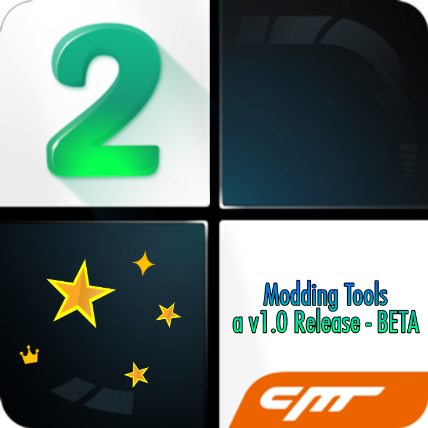

<h1 align="center">Piano Tiles 2 Modding Tools</h1>

    
     
    <strong>Fast, Easy, Modern</strong>

## Description
This is the apps called Piano Tiles 2 Modding Tools - The apps is now existed so you all no need to use the file and use another apps to open it anymore.However some device like iOS,IPhone or Tablet,they still use the file to open it because this apps only support Android only,iPA's is to be Plan to existed also but take time.

## Features

# Credits and Many Thanks
Thanks to the authors and contributors of the following projects, without whom this project would not have been possible. You may check their respective youtube channel by clicking their names.Very many and huge thanks to them consider give them support.

* [TastyBlackTiles](https://youtube.com/@tastyForReal?si=pbQ7NRk7xYtyJ0LZ) - For make and existing jsonmaker file
* [Beeps](https://youtube.com/@BeMusical.?si=PR0piK_5bu-ms4fT) - Make Tiles tool for easier to check song.
* [Voilan0](https://youtube.com/@Volian0?si=oKGykIiJUEIamV3Y) - For make executable software like midi2json,midiquantize, etc.
* [QD404](https://youtube.com/@QD404?si=en_ICu4q1WVsZni5) - A Guy who existing the apps first before i did. Converting code to apk but actually website to apk.
* [EchnixWulf](https://youtube.com/@EchnixWulf?si=hb8gYW267fNcMmY4) - Remastering the apps, fixing some random code structure.
* [VarxenCore9](https://youtube.com/@VarxenCore9?si=_x_UZV59yMIXmYnW) - for Making a video tutorial how to modding or modifying files in game assets.

&copy; 2015 - 202X - Piano Tiles 2 Fans and Community
--
Take Note
===
The software is completely free of charge. - Commercial use is strictly prohibited!
-